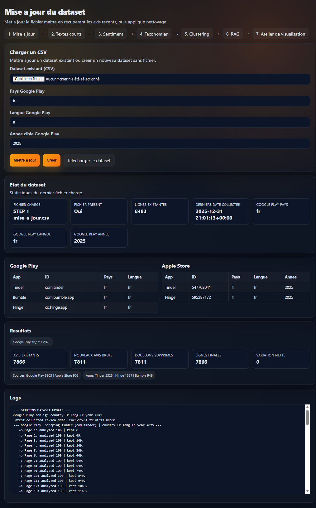
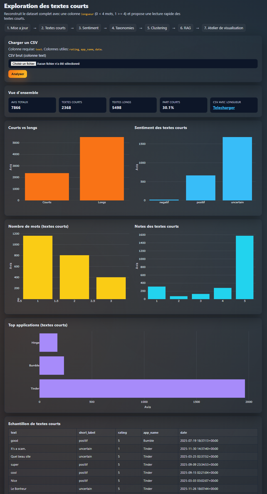
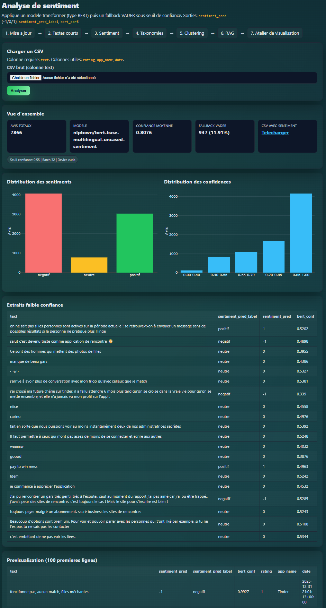
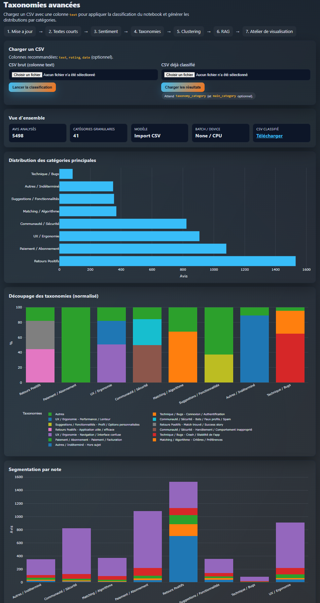
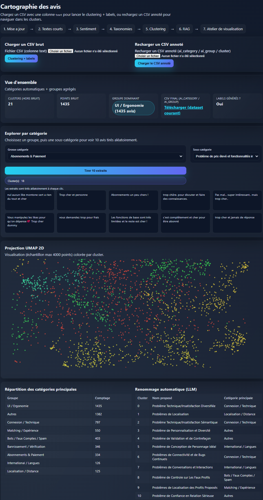
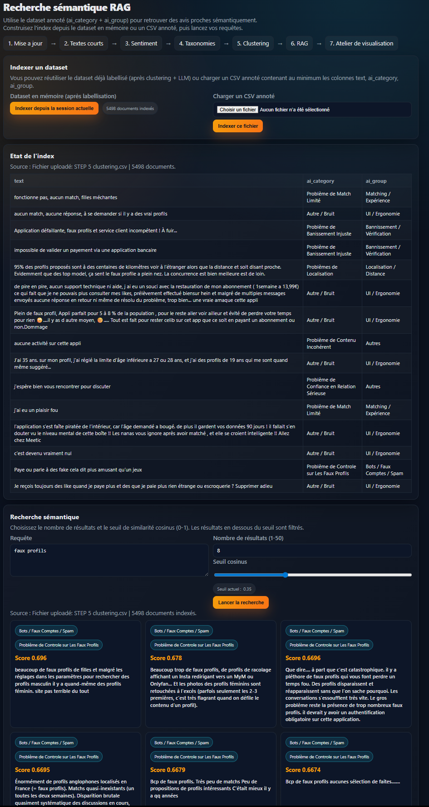
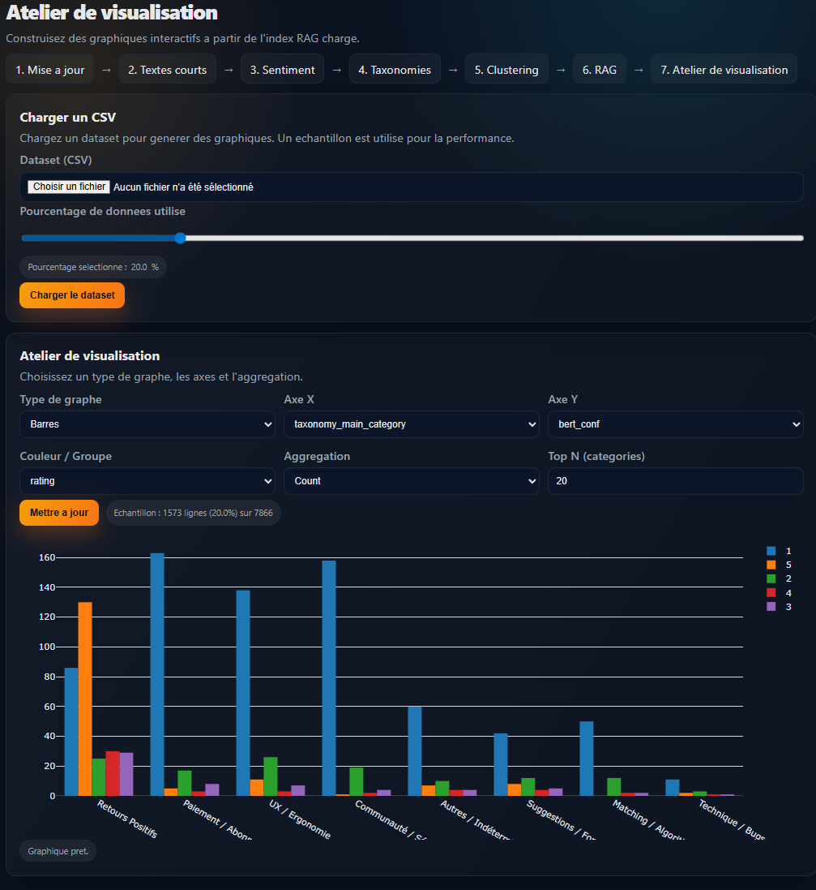

# Voice of Users - Dating Apps
Collect, clean, analyze, and explore app-store reviews (Google Play + Apple Store) to extract product insights, UX pain points, and actionable recommendations.

## Project overview
This project delivers an end-to-end analytics pipeline for dating-app reviews. It combines data collection, NLP enrichment, clustering, taxonomy tagging, sentiment analysis, and semantic search in a single Flask web app.

Core goals:
- Monitor market perception across Tinder, Bumble, Hinge, and related apps.
- Identify recurring irritants and opportunities for differentiation.
- Produce data-backed recommendations with evidence from real user feedback.

## What this app does
- Data ingestion: scrape Google Play and Apple Store reviews for a target year.
- Short review exploration: detect ultra-short feedback and infer quick sentiment hints.
- Sentiment analysis: multilingual BERT with confidence threshold + VADER fallback.
- Taxonomy classification: zero-shot tagging into a structured UX taxonomy.
- Clustering: UMAP + HDBSCAN, then LLM-based cluster labeling.
- RAG search: semantic search over reviews with Chroma + SentenceTransformers.
- Visualization payloads: sample data with inferred column types for charts.

## Deep analysis (architecture and design choices)
Strengths:
- Clear pipeline segmentation with dedicated services for each analytic step.
- Hybrid NLP strategy: embeddings + clustering + LLM labels + taxonomy.
- Language-aware heuristics (FR/EN detection via country column).
- Resilience: safe CSV decoding, short-text handling, low-confidence fallbacks.

Points of attention:
- Model downloads are heavy; first run can be long and memory-intensive.
- Clustering depends on UMAP/HDBSCAN hyperparameters tuned for large datasets.
- RAG index is in-memory (non-persistent) and resets per upload.
- Scraping relies on public endpoints; rate limits and schema changes can break.

Evolution opportunities:
- Add persistence for Chroma collections and model caches.
- Track experiment configs (batch size, thresholds, models) for reproducibility.
- Add monitoring for scraping failures and partial updates.
- Extend taxonomy with custom business dimensions (pricing, safety, retention).

## Pipeline steps (as implemented)
1) Update dataset (scraping / import) -> `data/STEP 1 mise_a_jour.csv`
2) Short reviews analysis -> `data/STEP 2 textes_courts.csv`
3) Sentiment analysis -> `data/STEP 3 sentiment.csv`
4) Taxonomy classification -> `data/STEP 4 taxonomies.csv`
5) Clustering + AI labels -> `data/STEP 5 clustering.csv`

## Project structure (key files)
- `app.py`: Flask routes and orchestration.
- `update_dataset.py`: Google/Apple review scraping.
- `clustering_service.py`: embeddings, UMAP, HDBSCAN, LLM labeling.
- `taxonomy_service.py`: zero-shot taxonomy classification.
- `sentiment_service.py`: transformer sentiment + VADER fallback.
- `rag_service.py`: Chroma indexing + semantic search.
- `short_review_service.py`: short-text exploration heuristics.
- `visualization_service.py`: sampling + column type inference.

## Requirements
Install dependencies:
```bash
python -m venv .venv
.\.venv\Scripts\activate
pip install -r requirements.txt
```

Run the web app:
```bash
python app.py
```
Open `http://localhost:5000`.

## Configuration (environment variables)
Core models:
- `LLM_MODEL_NAME` (default: `Qwen/Qwen2.5-1.5B-Instruct`)
- `LLM_TOKENIZER_NAME` (default: `Qwen/Qwen2.5-1.5B-Instruct`)
- `EMBEDDING_MODEL_NAME` (default: `sentence-transformers/all-MiniLM-L6-v2`)
- `TAXONOMY_MODEL_NAME` (default: `MoritzLaurer/deberta-v3-base-zeroshot-v1.1-all-33`)
- `SENTIMENT_MODEL_NAME` (default: `nlptown/bert-base-multilingual-uncased-sentiment`)

Batching and thresholds:
- `SENTIMENT_BATCH_SIZE` (default: 32)
- `SENTIMENT_MAX_LENGTH` (default: 256)
- `SENTIMENT_CONF_THRESHOLD` (default: 0.55)
- `TAXONOMY_BATCH_SIZE` (default: 32)
- `TAXONOMY_HYPOTHESIS` / `TAXONOMY_HYPOTHESIS_FR`

Scraping:
- `TARGET_YEAR` (default: 2025)
- `GOOGLE_COUNTRY` (default: `us`)
- `GOOGLE_LANG` (default: `en`)
- `GOOGLE_SLEEP_MIN` / `GOOGLE_SLEEP_MAX` (default: 1.0 / 3.0)

Visualization:
- `VIZ_MAX_ROWS` (default: 5000)

## Data expectations
Most analysis steps require a CSV with at least:
- `text` (required)
Recommended optional columns: `rating`, `app_name`, `date`, `country`.

The updater outputs a unified schema with:
- `review_id`, `date`, `source`, `app_name`, `country`, `rating`,
  `text`, `version`, `reply_content`, `reply_date`.

## Web pages
- `/update-dataset`: build or update the dataset
- `/short-reviews`: explore ultra-short reviews
- `/sentiment`: sentiment analysis
- `/taxonomies`: zero-shot taxonomy tagging
- `/clustering`: topic clustering + AI labels
- `/rag`: semantic search over reviews
- `/visualization`: chart-ready sampling

## Screenshots








## Notes
- No PII is required or stored; reviews are public app-store data.
- GPU is optional but recommended for faster embeddings and transformers.
